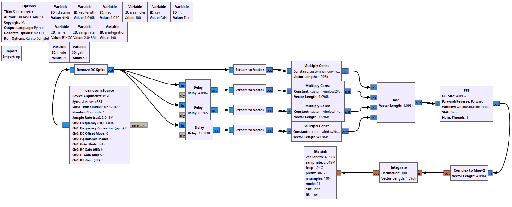

# GNURADIO FITS_SINK

Bloco GNURadio para gravação em formatos FITS e CSV.

Recomendado que você instale o gnuradio em um ambiente conda:
```
conda create -n gnuradio
conda activate gnuradio
conda config --env --add channels conda-forge
conda config --env --set channel_priority strict
conda install gnuradio=3.10 python=3.10 gnuradio-build-deps rtl-sdr gnuradio-osmosdr astropy
```

Para instalar o módulo siga o procedimento usual do `cmake`:

```
git clone endereço
cd GNURadioBlocks/gr_fits_sink
mkdir build
cd build
cmake ../
make
sudo make install
sudo ldconfig
```

Se você usa GNURADIO em um ambiente conda ou em endereço customizado em sua máquina local você deve informar o `cmake` sobre isso, por exemplo `cmake -DCMAKE_INSTALL_PREFIX=$CONDA_PREFIX ../ `.

Os parâmetros do módulo são:

- `vec_length`: tamanho do string de dados lido por vez.
- `samp_rate`: frequência de amostragem do sinal.
- `freq`: frequência central
- `prefix`: string que prefixa o nome dos arquivos.
- `n_samples`: número de amostras para cada arquivo.
- `mode`: string sufixo do nome do arquivo salvo
- `csv`: booleano para salvar ou não em formato CVS
- `fit`: booleano para salvar ou não em formato FITS

## Funcionamento do Bloco

O bloco lê "n_samples" da entrada de dados e produz uma matrix de `n_samples` linhas e `vec_length` colunas, representando o fluxo do tempo e as frequências, respectivamente. A faixa de frequências é de `freq - samp_rate/2` a `freq + samp_rate/2`.

O arquivo é gravado com o nome padronizado da seguinte forma:
```
prefix_YYMMDD_ HHMMSS_MODE.fit  
```

onde YYMMDD e HHMMSS represetam a data e o tempo de início da gravação.

A leitura se procede em um loop `work` do `GNURadio` e grava os arquivos sequencialmente, todos com o mesmo número de amostras.

Se a execução for manualmente interrompida os dados no buffer são salvos e o arquivo resultante será menor do que o usual, mas conterá todos os dados.

## Linha de comando

O programa `grc_flowgraphs/PFB_Spectrometer.py` é um flow gnuradio que usa o bloco, pode ser utulizado como exemplo para aprender suas funcionalidades.

O programa `grc_flowgraphs/GNUController.py` é um script em python que controla um flow do GNURadio, assumindo que existe um dispositivo RTLSDR escutando os comandos.

```bash
$ ./GNUController.py  --rtlsdr "rtl=0" --name "RTLSDR_teste" \
--mode "01" --vec_length 4096 --samp_rate 2048000 --gain 50 \
--freq 1420000000 --n_integration 100 --n_samples 1000 \
--duration 300 --csv --FIT
```

## Exemplo de FlowGraph


